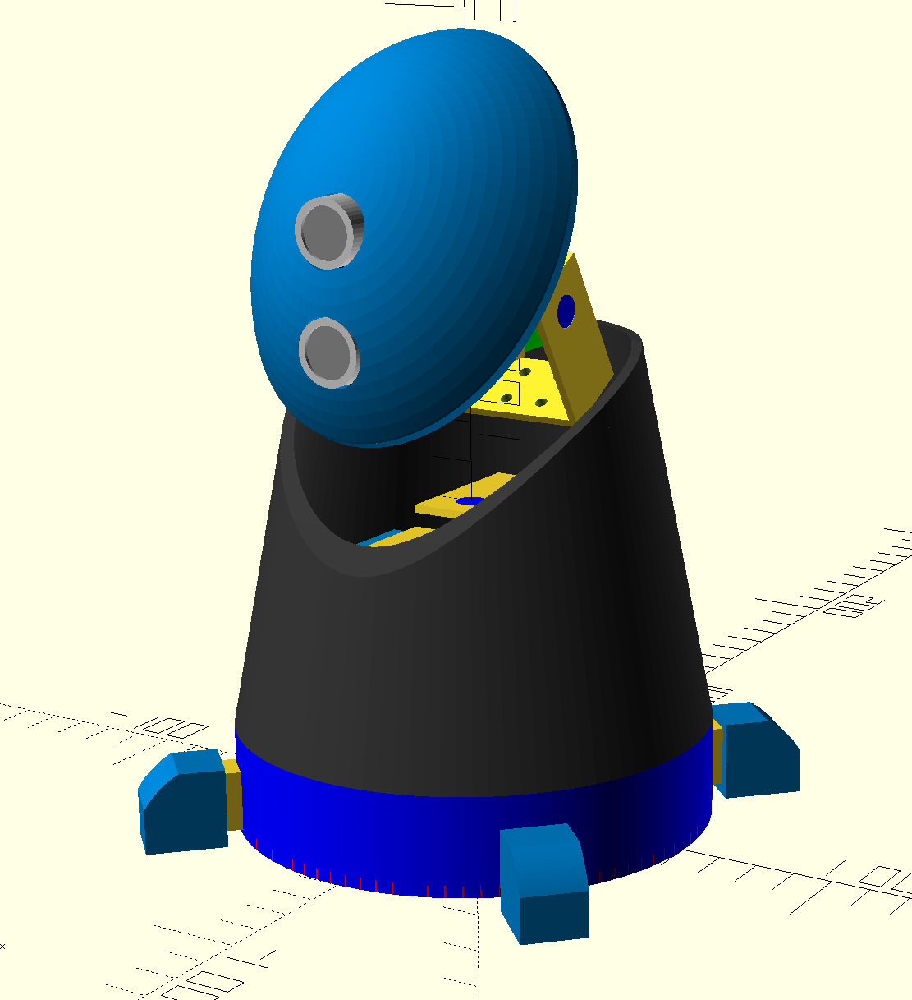

<!--  -->

# M.A.R.C.E.L

## Description

M.A.R.C.E.L stands for Minimalist Autonomous Robot Constantly Experiencing Life 

<!-- img alt="logov1" src="images/just_the_head_logo_v1.png" />

<!-- img alt="logov4" src="images/just_the_head_logo_v4.png" /-->

## Resources

Most of the files for this project are available on [Github](https://github.com/r1d1/KarotzLikeBot).

Project logs are available on [Robot-Maker](https://www.robot-maker.com/forum/topic/12548-project-marcel/) (FR).

<!-- 
| Time | Activity |
| --- | --- |
| 08:45-09:00 | Welcome |
| 09:00-09:30 | Place holders |
| 09:30-10:00 | Place holders |
| 10:00-10:30 | Place holders |
| 10:30-11:00 | Place holders |
| 11:00-11:30 | Place holders |
| 11:30-12:00 | Place holders | 
| 12:00-12:30 | Place holders |
| 12:30-13:30 | Place holders |
| 13:30-15:00 | Place holders |
| 15:00-15:30 | Place holders |
| 15:30-17:00 | **Place holders** |
| 17:00       | Place holders |
-->

